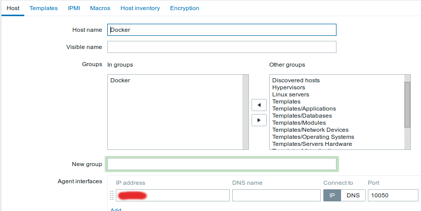
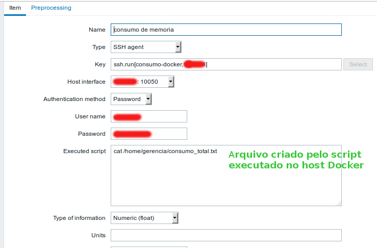
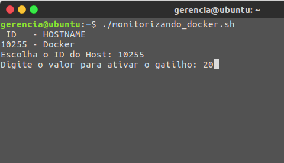
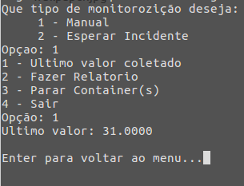

# Monitorizando o consumo de memória dos contêineres Docker com Zabbix
Neste projeto desenvolvemos alguns scripts que podem ser usado em conjunto com zabbix para monitorizar de forma reativa o consumo de memória dos contêineres Docker de forma geral (consumo total).

## Pendências
**No servidor Zabbix:**
- zabbix-server (pacotes necessários)
- python
- sshpass
- wkhtmltopdf (Necessário testar antes de executar o script. ex: `wkhtmltopdf google.com google.pdf`)
- Dar permissões ao usuário da máquina para ler e escrever no diretório `/home/www/` recursivamente

**No hospedeiro Docker**
- bc
- zabbix-agent

## Execução dos Scripts
**No hospedeiro Docker**

O script que irá atuar neste *host* é o `monitoring.sh` e deverá ser executado no diretório `/home/usuario/` da seguinte forma:
```
./monitoring.sh &
```
*OBS: Vale lembrar que este script deve ter permissão para execução, caso não tenha vindo ja com a permisão, utilize o comando a seguir `chmod +x monitoring.sh`*

A principal função deste script é apenas coletar a informação de consumo de memoria total e jogar como saida para um arquivo `.txt` que o mesmo servirá para que o zabbix tenha apenas a responsabilidade de coletar o dado ja calculado.

**No servidor Zabbix**

Nesta máquina iremos ter dois scripts, com finalidades diferentes, como por exemplo o script `monitorizando_docker.sh` é utilizado para monitorar e realizar ações de acordo com o consumo porém, o mesmo necessita da interação de um usuário/administrador de rede e além disso o script é dependende de configuração do zabbix, ou seja, é necessario realizar a configuração do `host` e do `item`  pela interface do zabbix.

Já o script `monitorizando_auto.sh` também necessita da configuração do `host`, do `item`, da `trigger` e de algumas `macros` pela interface do Zabbix porém, o mesmo não necessita da interação com o usuário.

Caso o usuário decida executar o `monitorizando_docker.sh`
Devemos realizar a seguinte configuração.

Decidimos criar um grupo de host.


Criamos o host.



Criamos o item.



As tarjas vermelhas foram utilizadas para esconder IP, Usuario e SENHA da maquina alvo (host Docker).

Feito essas configurações, o script `monitorizando_docker.sh` pode ser executado da seguinte maneira:
```
./monitorizando_docker.sh
```
Durante a execução, algumas informações serão requisitadas, como o ID do host, valor para o gatilho (em porcentagem) e o tipo de monitorizando, onde o usuário poderá optar por **Manual** ou **Esperar Incidente**.

Na opção **Manual** o usuário terá um menu com opções de VER ULTIMA COLETA, FAZER RELATÓRIO (manual ou padrão), PARAR CONTAINERS ou SAIR.
- VER ULTIMA COLETA - consiste apenas no ultimo valor coletado pelo zabbix
- FAZER RELATORIO - O usuário pode optar por `manual`, nesse caso ele deverá possuir conhecimentos em comandos de sistemas Linux como, px aux, ls e varios outros pois com esses comandos o mesmo pode fazer um relatorio de acordo com suas necessidades. Ja na opção `padrão` o relatório consiste em informações da memoria, carga média, processos em execução e conteudo dos diretórios /home, / e /root.
- PARAR CONTAINERS - Todos os containers ativos serão exibido na tela e o usuário poderár digitar o ID do Container que o mesmo deseja parar.
- SAIR - parar o script.

Caso opte por **Esperar Incidente** As mesmas opções citadas acima só apareceram quando o ultimo valor coletado for maior que o valor do gatilho definido durante a execução do script.

Alguns prints da execução do script.




