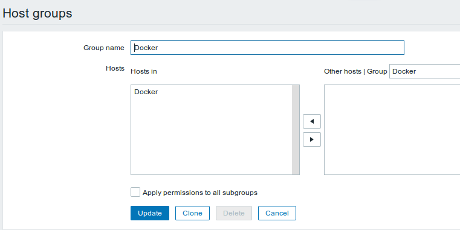
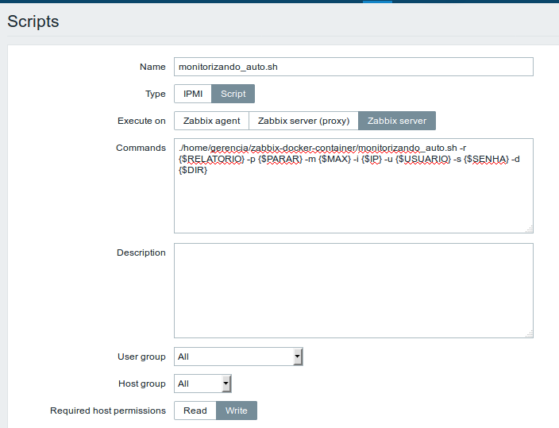

# Monitorizando o consumo de memória dos contêineres Docker com Zabbix
Neste projeto desenvolvemos alguns scripts que podem ser usado em conjunto com zabbix para monitorizar de forma reativa o consumo de memória dos contêineres Docker de forma geral (consumo total).

## Pendências
**No servidor Zabbix:**
- zabbix-server (pacotes necessários)
- python
- sshpass
- wkhtmltopdf (Necessário testar antes de executar o script. ex: `wkhtmltopdf google.com google.pdf`)
- Dar permissões ao usuário da máquina para ler e escrever no diretório `/home/www/` recursivamente

**No hospedeiro Docker**
- bc
- zabbix-agent

## Execução dos Scripts
**No hospedeiro Docker**

O script que irá atuar neste *host* é o `monitoring.sh` e deverá ser executado no diretório `/home/usuario/` da seguinte forma:
```
./monitoring.sh &
```
*OBS: Vale lembrar que este script deve ter permissão para execução, caso não tenha vindo ja com a permisão, utilize o comando a seguir `chmod +x monitoring.sh`*

A principal função deste script é apenas coletar a informação de consumo de memoria total e jogar como saida para um arquivo `.txt` que o mesmo servirá para que o zabbix tenha apenas a responsabilidade de coletar o dado ja calculado.

**No servidor Zabbix**

Nesta máquina iremos ter dois scripts, com finalidades diferentes, como por exemplo o script `monitorizando_docker.sh` é utilizado para monitorar e realizar ações de acordo com o consumo porém, o mesmo necessita da interação de um usuário/administrador de rede e além disso o script é dependende de configuração do zabbix, ou seja, é necessario realizar a configuração do `host` e do `item`  pela interface do zabbix.

Já o script `monitorizando_auto.sh` também necessita da configuração do `host`, do `item`, da `trigger` e de algumas `macros` pela interface do Zabbix porém, o mesmo não necessita da interação com o usuário.

Caso o usuário decida executar o `monitorizando_docker.sh`
Devemos realizar a seguinte configuração.

Decidimos criar um grupo de host.



Criamos o host.


Criamos o item.


As tarjas vermelhas foram utilizadas para esconder IP, Usuario e SENHA da maquina alvo (host Docker).

Feito essas configurações, o script `monitorizando_docker.sh` pode ser executado da seguinte maneira:
```
./monitorizando_docker.sh
```
Durante a execução, algumas informações serão requisitadas, como o ID do host, valor para o gatilho (em porcentagem) e o tipo de monitorizando, onde o usuário poderá optar por **Manual** ou **Esperar Incidente**.

Na opção **Manual** o usuário terá um menu com opções de VER ULTIMA COLETA, FAZER RELATÓRIO (manual ou padrão), PARAR CONTAINERS ou SAIR.
- VER ULTIMA COLETA - consiste apenas no ultimo valor coletado pelo zabbix
- FAZER RELATORIO - O usuário pode optar por `manual`, nesse caso ele deverá possuir conhecimentos em comandos de sistemas Linux como, px aux, ls e varios outros pois com esses comandos o mesmo pode fazer um relatorio de acordo com suas necessidades. Ja na opção `padrão` o relatório consiste em informações da memoria, carga média, processos em execução e conteudo dos diretórios /home, / e /root.
- PARAR CONTAINERS - Todos os containers ativos serão exibido na tela e o usuário poderár digitar o ID do Container que o mesmo deseja parar.
- SAIR - parar o script.

Caso opte por **Esperar Incidente** As mesmas opções citadas acima só apareceram quando o ultimo valor coletado for maior que o valor do gatilho definido durante a execução do script.

Alguns prints da execução do script.


Para executar o script `monitorizando_auto.sh` necessitamos realizar algumas configurações no frontend do zabbix, tambem existe algumas pendencias no arquivo de configuração do zabbix `/etc/zabbix/zabbix_server.conf` que são:

Adicionar a linha
```
SSHKeyLocation=/var/lib/zabbix//.ssh
```
Criar o diretório:
```
sudo mkdir -p /var/lib/zabbix//.ssh
```
Copiar o arquivo `known_hosts` para `/var/lib/zabbix//.ssh`
```
sudo cp .ssh/known_hosts /var/lib/zabbix//.ssh/
```
Reiniciar o zabbix:
```
sudo service zabbix-server restart
```
É necessário dar algumas permissões para o usuário `zabbix` ou mudar o dono de alguns arquivos e diretórios, no nosso caso vamos mudar o dono. Dentro do diretório deste porjeto terá dois arquivo `.txt` e um diretório `relatórios` que devemos mudar o dono.
```
sudo chown zabbix dados.txt estado_atual.txt
```
```
sudo chown -R zabbix relatorios
```
Além disso, usamos o `/var/www/` para criar uma pagina html e a partir dela gerar um pdf então devemos mudar o dono.
```
sudo chown -R zabbix /var/www
```
Depois de realizar todas essas configurações, agora podemos realizar as demais configurações de monitorização.

Criando Grupo:


Criando Host:


Adicionando Variaveis Macros para o host:
- `{$RELATORIO}` = 1 ativa, 0 desativa.
- `{$PARAR}` = 1 ativa, 0 desativa.
- `{$MAX}` = Qualquer container que esteja consumindo a memoria acima desse valor, poderá ser realizado Relatorio ou poderá ser parado (depende das variaveis acima).
- `{$IP}` = IP da maquina alvo.
- `{$USUARIO}` = Usuário da máquina alvo.
- `{$SENHA}` = SENHA do usuário da máquina alvo.
- `{$DIR}` = Caminho completo do diretório deste projeto

Qualquer duvida execute o script pelo terminal passando apenas o argumento `-h`


Criando Script

Existe duas maneiras de adicionar o comando, umdas é utlizando a variavel macro `{$DIR}` e passando o script e os argumentos (que vamos entender durante este arquivo)

Utilizando `.{$DIR}monitorizando_auto.sh [options] [args]`


Utilizando o caminho completo `./homem/usuario/diretorio_prjeto/monitorizando_auto.sh [options] [args]`



Atenção para as permissões requeridas pelo host.

Criando Item:


Este arquivo `consumo_total.txt` é criado no mesmo diretório em que é executado o `monitoring.sh` no host docker.

Criando Trigger:


O valor `15` é referente a porcentagem maxima de consumo de memoria (total) dos containers, ja a macro `{$MAX}` é referente a cada container separadamente e é a macro que será utilizada para fazer relatorio e/o parar container.

Trigger Disparada:


Executando Script:

Clique no nome do host e aparecerar os scripts disponivel:


Clique no script que criamos e ele será executado.

Saida do Script:

Nessa execução decidimos fazer apenas o relatorio dos containers como configuramos nas macros


Caso desejamos parar os containers que estão consumindo a memória acima do valor da macro `{$MAX}`, devemos mudar o valor da macro `{$PARAR}` para 1, depois de realizarmos isso, execute o script novamente.

Parando Containers:


Nas figuras abaixo podemos ver o relatorio do container da primeira execução do script e o status do container da seguna execução, respectivamente.


Entendendo as opções do Script:
- -r ---> Para ativar ou não os relatórios, o valor 1 é ativo e o valor 0 é desativado.
- -p ---> Para contêineres automaticamente, o valor 1 está ativo e o valor 0 está desativado.
- -m ---> Para definir o uso máximo em porcentagem (inteiro) da memória de cada contêiner. contêineres usando memória acima desse valor serão interrompidos.
- -i ---> IP da máquina alvo.
- -u ---> Usuário da máquina alvo.
- -s ---> Senha do usuário da máquina alvo.
- -d ---> Caminho completo do diretório dos scripts (somente caminho) no servidor zabbix.
